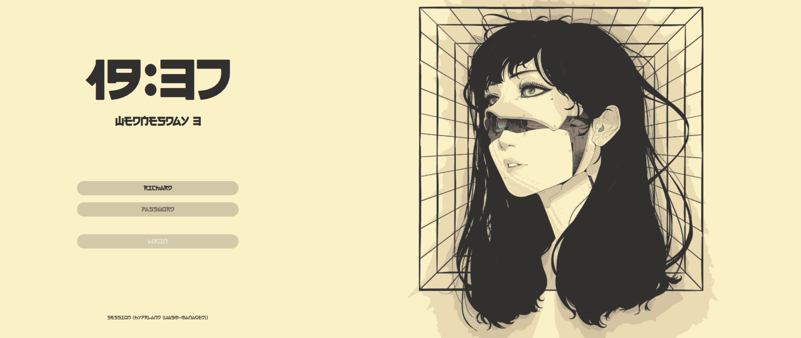

Notes for running COSMIC alongside Omarchy/Hyprland, using SDDM for session selection, and adding a logout path.

::: {.callout-warning}
These commands modify login/session configuration and sudo permissions. Back up files before editing them and check paths on your system.
:::

## disable autologin

On this setup, Omarchy autologin is configured in:

```text
/etc/sddm.conf.d/autologin.conf
```

A typical file looks like:

```ini
[Autologin]
User=<your_user>
Session=hyprland-uwsm

[Theme]
Current=breeze
```

Back it up, then remove it:

```bash
sudo cp /etc/sddm.conf.d/autologin.conf /etc/sddm.conf.d/autologin.conf.bak
sudo rm /etc/sddm.conf.d/autologin.conf
```

## install COSMIC

```bash
sudo pacman -Syu
sudo pacman -S cosmic --ignore cosmic-initial-setup
sudo systemctl restart sddm
```

After SDDM restarts, select COSMIC from the session selector on the login screen.

The `--ignore cosmic-initial-setup` workaround was needed when the Omarchy mirror returned a 404 for that package. If the package is available normally, install COSMIC without the ignore flag.

### hyprctl exit issue

```bash
hyprctl dispatch exit
```

produced a black screen on this setup. Restarting SDDM worked instead:

```bash
sudo systemctl restart sddm
```

## add another user

```bash
sudo useradd -m -G wheel,network -s /bin/bash <user_name>
sudo passwd <user_name>
```

- `-m`: create the home directory
- `-G`: add supplementary groups
- `-s`: set the login shell

Check that the groups you specify exist and are appropriate for the account.

## theme SDDM

This setup uses [sddm-astronaut-theme](https://github.com/Keyitdev/sddm-astronaut-theme/).

The project provides an installer:

```bash
sh -c "$(curl -fsSL https://raw.githubusercontent.com/keyitdev/sddm-astronaut-theme/master/setup.sh)"
```

Review remote install scripts before piping them to a shell.

Theme selection is controlled by:

```text
/usr/share/sddm/themes/sddm-astronaut-theme/metadata.desktop
```

For example:

```ini
[SddmGreeterTheme]
Name=sddm-astronaut-theme
Description=sddm-astronaut-theme
Author=keyitdev
Website=https://github.com/Keyitdev/sddm-astronaut-theme
License=GPL-3.0-or-later
Type=sddm-theme
Version=1.3
ConfigFile=Themes/japanese_aesthetic.conf
Screenshot=Previews/astronaut.png
MainScript=Main.qml
TranslationsDirectory=translations
Theme-Id=sddm-astronaut-theme
Theme-API=2.0
QtVersion=6
```

Available configuration files are listed in the project's [Themes directory](https://github.com/Keyitdev/sddm-astronaut-theme/tree/master/Themes).



## add logout to the Omarchy menu

Back up the menu script:

```bash
cp ~/.local/share/omarchy/bin/omarchy-menu ~/.local/share/omarchy/bin/omarchy-menu.bak
```

Restore it with:

```bash
cp ~/.local/share/omarchy/bin/omarchy-menu.bak ~/.local/share/omarchy/bin/omarchy-menu
```

In `~/.local/share/omarchy/bin/omarchy-menu`, add a logout entry to `show_system_menu`:

```bash
show_system_menu() {
  case $(menu "System" "  Lock\n󱄄  Screensaver\n󰤄  Suspend\n󰗼  Logout\n󰜉  Restart\n󰐥  Shutdown") in
  *Lock*) omarchy-lock-screen ;;
  *Screensaver*) omarchy-launch-screensaver force ;;
  *Suspend*) systemctl suspend ;;
  *Logout*) sudo systemctl restart sddm ;;
  *Restart*) omarchy-cmd-reboot ;;
  *Shutdown*) omarchy-cmd-shutdown ;;
  *) back_to show_main_menu ;;
  esac
}
```

Because restarting SDDM normally requires a password, the original setup added this with `sudo visudo`:

```text
%wheel ALL=(root) NOPASSWD: /usr/bin/systemctl restart sddm
```

::: {.callout-warning}
That rule allows every user in `wheel` to restart SDDM without a password. Use it only if that permission is acceptable on the machine.
:::
